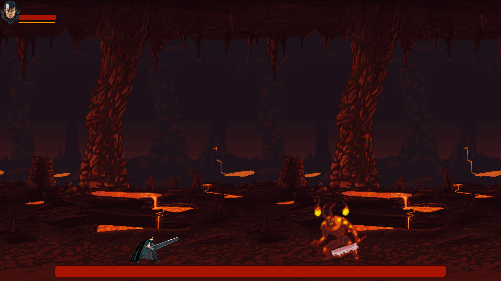

# Guts' Revenge: A Berserk and Dark Souls Inspired 2D Combat Game


## Status do Projeto

🚧 **Este projeto está em desenvolvimento.** Algumas funcionalidades podem não estar completas e podem ocorrer mudanças significativas no código. Fique à vontade para contribuir e acompanhar o progresso!

## Sobre o Projeto



**Guts' Revenge** é um jogo 2D de combate desenvolvido em Lua 5.4.2 e Love2D 11.5. Baseado no mundo de Berserk, você assume o papel de Guts em uma jornada de vingança e batalha. O jogo também incorpora elementos de Dark Souls, incluindo trilhas sonoras imersivas e uma jogabilidade desafiadora.

## Instalação

### Requisitos

- [Love2D 11.5](https://love2d.org/)
- [Lua 5.4.2](https://www.lua.org/)

### Configurando o Ambiente

1. **Instale o Love2D:**
   - Baixe a versão mais recente do Love2D 11.5 [aqui](https://love2d.org/).
   - Siga as instruções de instalação para o seu sistema operacional.

2. **Instale o Lua 5.4.2:**
   - Siga este guia de instalação do Lua 5.4.2: [Tutorial de Instalação do Lua](https://www.youtube.com/watch?v=zXW7YqoMUpA).

### Executando o Jogo

1. **Clone o Repositório:**

   ```sh
   git clone https://github.com/seu-usuario/2D_Game_Berserk.git
   cd 2D_Game_Berserk

2. **Execute o jogo**
    
    Se você estiver no diretório do projeto, execute:
    
        love .

## Controles do Jogo

- **W**: Saltar
- **A**: Andar para a esquerda
- **S**: Abaixar
- **D**: Andar para a direita
- **Setas Direcionais**: Mover o personagem
- **Espaço**: Usar o especial (quando a barra laranja no canto superior estiver cheia)
- **J**: Atacar
- **K**: Defender
- **Shift**: Rolamento

## Contribuição

Contribuições são bem-vindas! Sinta-se à vontade para abrir uma issue ou enviar um pull request.

---

## Colaboradores

Agradecimentos especiais aos nossos colaboradores:

- [Iuri-silva](https://github.com/Iuri-silva)
- [GomesMilla](https://github.com/GomesMilla)
- [PsychoBurns](https://github.com/PsychoBurns)

## Licença

Este projeto está licenciado sob a [MIT License](LICENSE).

---

Feito com ❤️ por [Gustavo Alessandro](https://github.com/GustSilvaJR)

